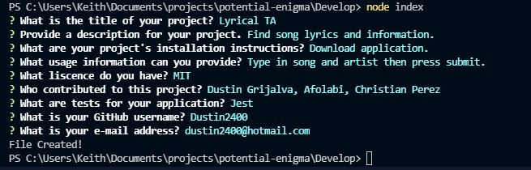

  
  # README Generator 

  ## Description
  This application creates a professional README after a series of prompts.

  ## Table of Contents
  *[Installation](#installation)

  *[Usage](#usage)

  *[Links](#links)

  ## Installation
  Node.js and the npm application inquirer are required to run the application.

  ## Usage
  Simply download node.js, install inquirer from the npm server, and run the program byt typeing node index in the command line. Answer all the questions and a README for your application will be created.
  

  ## Links

  [GitHub](https://github.com/Dustin2400/readme-generator)

  [Video](https://watch.screencastify.com/v/6CAOINvoBZ9g5yjHUkPz)

##
  Made with ❤️ by Dustin Grijalva

